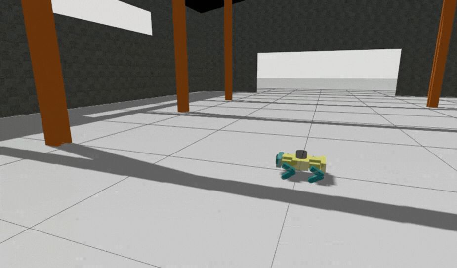
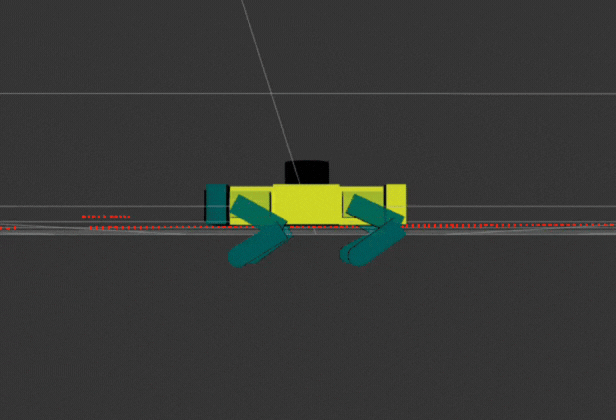
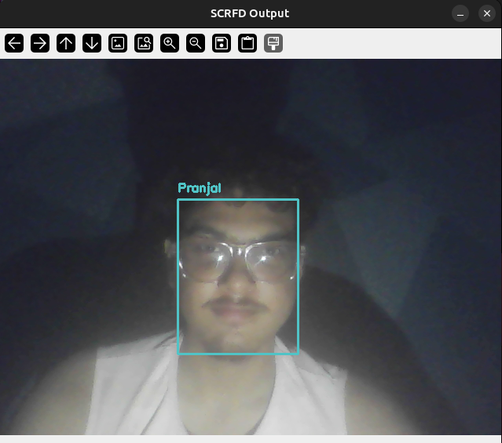
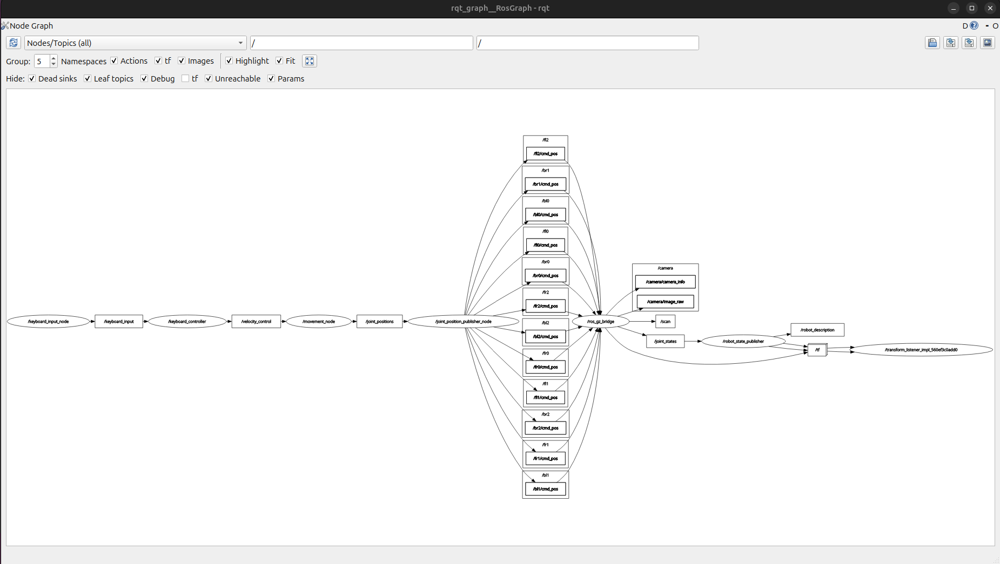
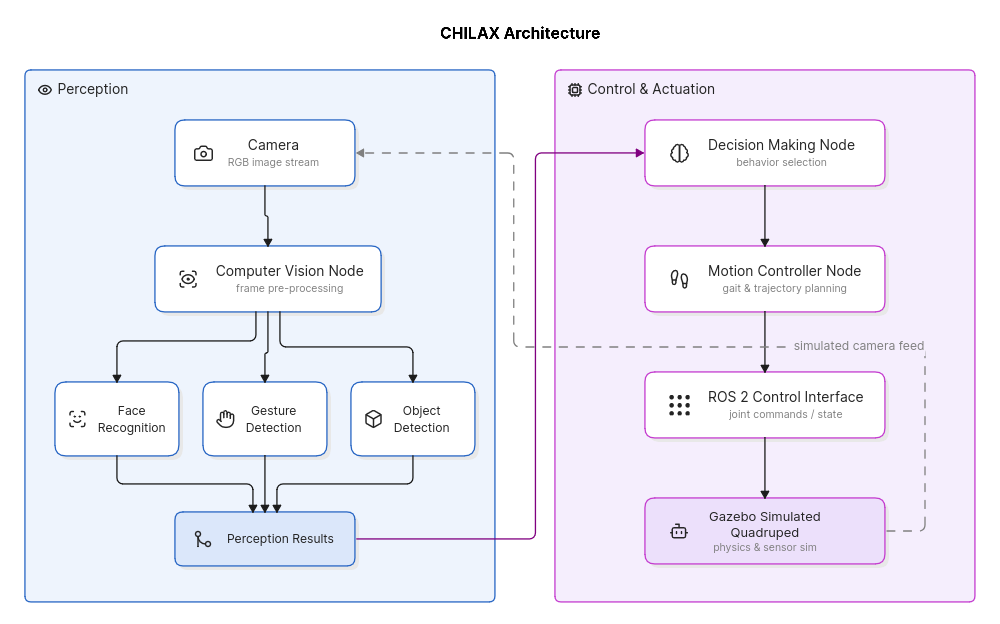
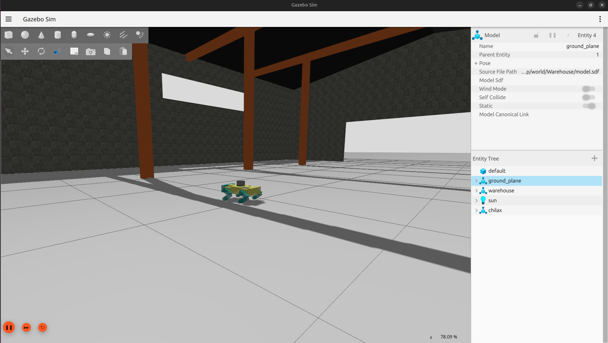
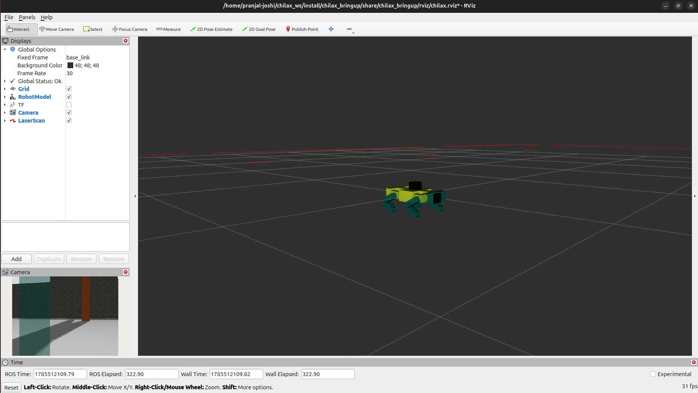
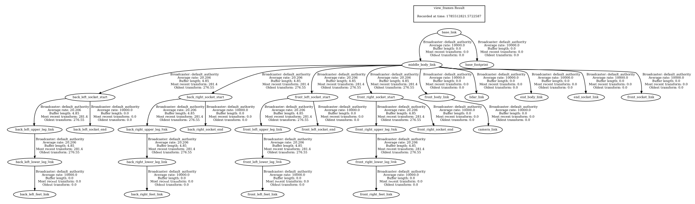

# CHILAX

### ROS 2 Quadruped Robot Simulator

> **An autonomous quadruped robot built using ROS 2, Gazebo, and RViz with an emphasis on modular software architecture and AI-powered perception.**


---

## Overview

CHILAX is a modular quadruped robot developed using the **Robot Operating System 2 (ROS 2)** ecosystem. The project focuses on creating an intelligent robotic platform capable of interacting with its environment through computer vision while maintaining a clean and scalable software architecture.

Although the project is currently simulation-based using **Gazebo** and **RViz**, it has been designed with real-world deployment in mind. Every module is built independently so that simulation components can later be replaced with physical hardware without significant architectural changes.

The long-term vision is to transform CHILAX into an intelligent robotic companion capable of autonomous navigation, human recognition, gesture understanding, voice interaction, and cloud-based monitoring.

---

# Demo

| Demo                      | Description                                   |
| ------------------------- | --------------------------------------------- |
| Robot Simulation       | Robot walking inside Gazebo                   |
| Keyboard Teleoperation | Manual robot control                          |



| Demo                      | Description                                   |
| ------------------------- | --------------------------------------------- |
| RViz Visualization     | Robot Model and sensor visualization |



| Demo                      | Description                                   |
| ------------------------- | --------------------------------------------- |
| Face Recognition       | AI identifies registered users                |\



| Demo                      | Description                                   |
| ------------------------- | --------------------------------------------- |
| ROS Graph              | Communication between ROS nodes               |



---

# Features

## Simulation

* Fully simulated quadruped robot
* Gazebo physics simulation
* RViz visualization
* ROS2 Control integration
* Keyboard teleoperation
* Robot State Publisher
* Joint State Publisher
* Modular launch system

---

## Computer Vision

Current capabilities include

* Face detection
* Face recognition
* User registration
* Multiple facial embedding storage
* Real-time identity recognition
* Camera integration

Planned capabilities include

* Gesture recognition
* Object detection
* Human tracking
* Pose estimation
* Activity recognition

---

## Software Architecture

The project follows a modular ROS2 architecture where each subsystem is isolated into independent nodes.

Advantages include

* Easy debugging
* Better scalability
* Easier maintenance
* Independent module development
* Hardware-independent design

Future perception modules can be added without modifying existing robot control code.

---

# System Architecture



---

# Getting Started

## Requirements

* Ubuntu 24.04
* ROS2 Jazzy
* Gazebo
* RViz2
* Python 3
* OpenCV
* NumPy

---

## Clone Repository

```bash
git clone https://github.com/pranjal-joshi-23/CHILAX.git

cd CHILAX
```

---

## Build

```bash
colcon build
```

---

## Source Workspace

```bash
source install/setup.bash
```

---

## Launch Simulation

```bash
ros2 launch chilax_bringup display.launch.xml
```

---

## Keyboard Teleoperation

```bash
ros2 run chilax_controlls user_keyboard_input
```

---

# Simulation

The robot is entirely simulated inside Gazebo, allowing safe development and testing before physical deployment.

Simulation includes

* Robot dynamics
* Joint controllers
* Camera sensor
* Physics engine
* Collision detection

RViz provides

* Robot Model
* TF visualization
* Camera stream
* Coordinate frames
* Joint states

---

# Screenshots

## Gazebo



---

## RViz



---

## Face Recognition


---

## ROS Graph


---

## TF Tree



---

# 💻 Technologies Used

### Robotics

* ROS 2
* Gazebo
* RViz2
* ros2_control

### Programming

* Python

### Computer Vision

* OpenCV
* InsightFace
* NumPy

### Development

* Git
* GitHub
* Linux
* VS Code

---

# Design Philosophy

Instead of building a monolithic robot application, CHILAX follows a modular design where each subsystem has a clearly defined responsibility.

The robot controller never directly performs computer vision.

The perception system never controls robot movement.

Decision making acts as the bridge between perception and motion.

This separation makes the project easier to extend, debug, and eventually migrate from simulation to physical hardware.

---

# Future Vision

The long-term goal of CHILAX is to become a fully autonomous intelligent quadruped capable of

* Recognizing people
* Understanding gestures
* Detecting surrounding objects
* Navigating unknown environments
* Responding to voice commands
* Remote operation through a web interface
* Cloud monitoring
* AI-assisted interaction

---

# License

This project is licensed under the MIT License.

---

# ⭐ Support

If you found this project useful, consider giving it a **⭐ Star** on GitHub.

It helps the project reach more robotics enthusiasts and motivates further development.

---

> *"Building intelligent robots isn't about making machines move, it's about designing systems that can perceive, reason, and interact with the world."*

